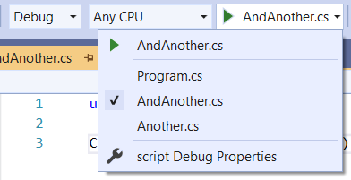
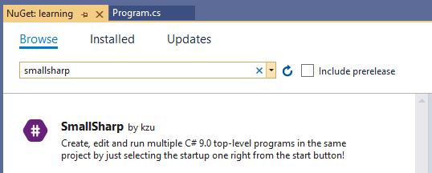
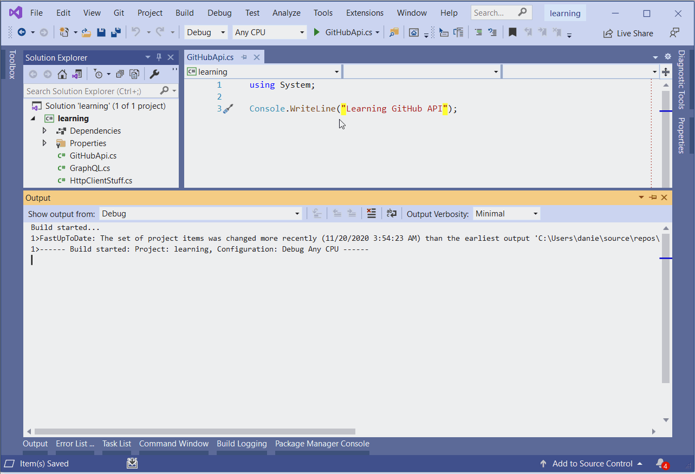

 SmallSharp
============

Create, edit and run multiple C# 9.0 top-level programs in the same project by just selecting the startup file right from the Run button!



[](https://www.nuget.org/packages/SmallSharp)
[](https://www.nuget.org/packages/SmallSharp)
[](https://github.com//kzu/SmallSharp/blob/main/LICENSE)
[](https://github.com/kzu/SmallSharp/actions)
[](https://pkg.kzu.io/index.json)

## Why

The new C# 9 [top-level programs](https://devblogs.microsoft.com/dotnet/welcome-to-c-9-0/#top-level-programs) allow a very intuitive, simple and streamlined experience for quickly spiking or learning C#. 

One missing thing since its introduction in Visual Studio 16.8 is that you can only have one such top-level programs in a project. This means that in order to prototype or learn a different area of .NET, you'd be forced to either replace your previous top-level program or change it to be a non-compile item somehow so you can keep it around (i.e. rename to a `.txt` or change its build action).

**SmallSharp** brings that very feature by automatically generating a launch profile for each `.cs` file at the project level so you can just select which top-level program should be the startup item (for compilation and launch/debug).

This list is automatically kept in sync as you add more `.cs` files to the project. When you select one target C# file, that becomes the only top-level program to be compiled, so you don't have to modify any of the others since they automatically become *None* items.

All compile files directly under the project directory root are considered top-level programs for selection and compilation purposes. If you need to share code among them, you can place them in subdirectories and those will behave like normal compile items.

## Usage

There is no need to install any Visual Studio extension. SmallSharp works by just installing the `SmallSharp` nuget package in a C# 9.0 project (such as a .NET 5.0 project).

1. Create a new Console (.NET Core):


   By default, this new console project may not be set up to target `net5.0` or use the latest C# version. 
   So click on the project node, and the project file will open in the editor. Make sure you either:

  * Target `net5.0` framework:

```xml
<Project Sdk="Microsoft.NET.Sdk">

  <PropertyGroup>
    <OutputType>Exe</OutputType>
    <TargetFramework>net5.0</TargetFramework>
  </PropertyGroup>

</Project>
```

  * Or use latest C# language version if targeting another framework:

```xml
<Project Sdk="Microsoft.NET.Sdk">

  <PropertyGroup>
    <OutputType>Exe</OutputType>
    <TargetFramework>net472</TargetFramework>
    <LangVersion>latest</LangVersion>
  </PropertyGroup>

</Project>
```
 
2. Install the **SmallSharp** nuget package using your preferred method:

  * From the Dependencies node, Manage NuGet Packages dialog:



   * By just adding it directly to the .csproj:

```xml
  <ItemGroup>
    <PackageReference Include="SmallSharp" Version="*" />
  </ItemGroup>
```

   * Via the dotnet CLI:

```
> dotnet add package SmallSharp
```

   * Via the Package Manager console:

```
PM> install-package SmallSharp
```

3. Now open that Program.cs, and replace it all with a nice concise top-level program like:

```csharp
using System;
using static System.Console;

WriteLine("Hello World!");
```

Keep adding as many top-level programs as you need, and switch between them easily from the Run button dropdown or by simply changing the active document:



## How It Works

This nuget package leverages in concert the following standalone and otherwise 
unrelated features of Rosly, Visual Studio and MSBuild:

1. The C# compiler only allows one top-level program per compilation.
2. Launch profiles (the entries in the Run dropdown) are populated from the Properties\launchSettings.json file
3. Whenever changed, the dropdown selection is persisted as the `$(ActiveDebugProfile)` MSBuild property in a file named after the project with the `.user` extension
4. This file is imported before NuGet-provided MSBuild targets
5. The `$(DefaultItemExcludesInProjectFolder)` MSBuild property allows excluding items at the project-level from the automatically added items by the SDK.

Using the above features in concert, **SmallSharp** essentially does the following:

a. Use a C# 9.0 [source generator](https://github.com/dotnet/roslyn/blob/master/docs/features/source-generators.cookbook.md) to enumerate `.cs` files directly under the project root and add them as entries in the `launchSettings.json` file. This causes VS to show them as available startup items in the Run button.

b. Exclude `.cs` files at the project level from being included as `<Compile>` by the default SDK includes and include them explicitly as `<None>` instead so they show up in the solution explorer. This prevents the compiler from causing an error for multiple top-level programs.

c. Explicitly include as `<Compile>` only the `$(ActiveDebugProfile)` property value, which due to `a.` and `3.` (from above), will be the source file we selected to "Run".

This basically mean that this it will also work consistently if you use `dotnet run` from the command-line, since the "Main" file selection is performed exclusively via MSBuild item manipulation.

Finally, there is some lovely COM-based magic to access the active Visual Studio IDE (via DTE) and automatically open the selected startup file, as well as monitor the currently opened source file to keep it in sync with the launch profile selection. This is done purely using public COM primitives and equally public VSSDK nuget packages their APIs. This enables some useful integration with the IDE without requiring to install a VS extension from the marketplace and deal with gracefully degrading functionality.